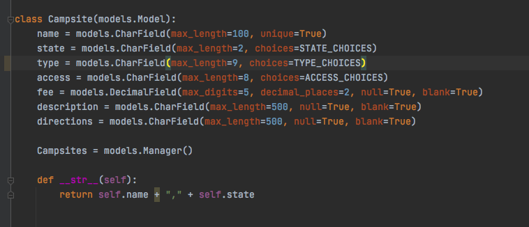
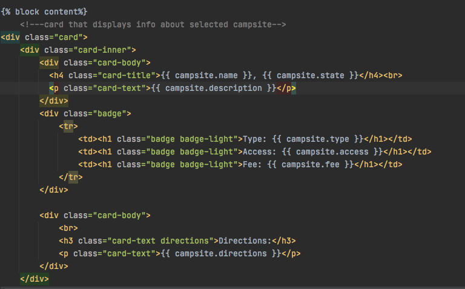
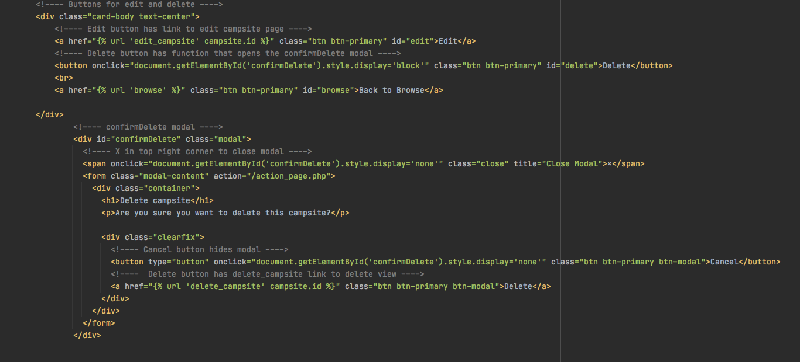
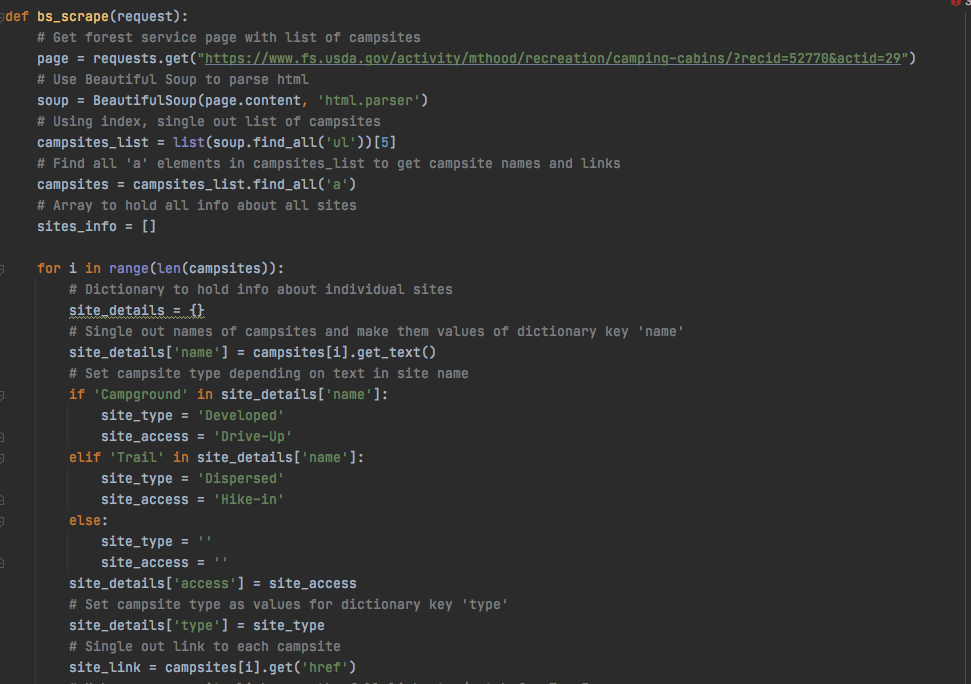
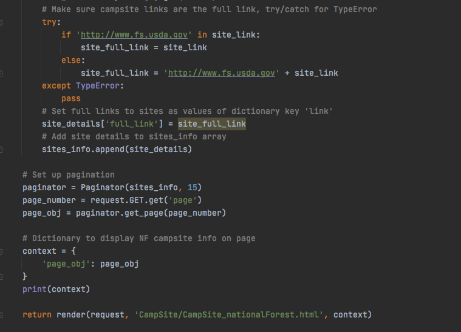
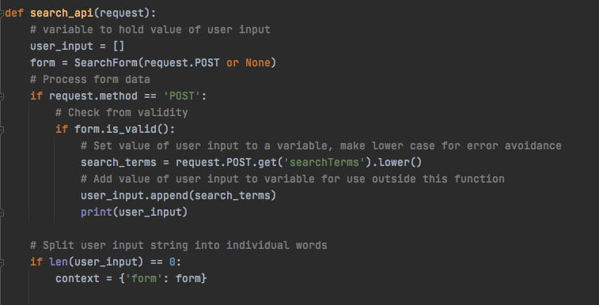
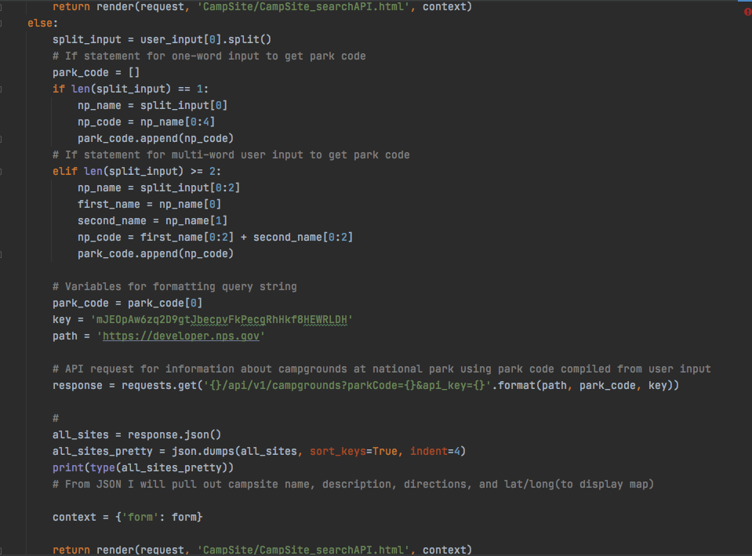

# CampSite-App

## Introduction
I worked with a team of other developers to create a collection of web applications using the agile scrum methodology. I built an application utilizing python and the Django framework that allows users to add campsites they have visited in the pacific northwest to a database, search the database for campsites, and rate campsites. I used beautiful soup to scrape the national forest website to add all national forest campsites in Oregon to the database, and connected to the National Parks API so that users are able to search for campsites at all national parks through my CampSite app. 

## Stories
* Build the Basic App
* Create the Model
* Display All Database Items
* Create the Details Page
* Edit and Delete Functions
* Set up Beautiful Soup and Parse through HTML
* Connect to API and Parse through JSON

 
### Build the Basic App
I created a new app called CampSite within the larger Main App and registered it within the Main Project.  I made base and home templates, added function to the views in order to render the pages and registered the urls with the Main App.  I also created a urls.py for my local urls, linked CampSite to the Main App, and added basic styling and content such as a navbar, background, title and footer to my home and base bages.

### Create the Model
I made a model containing all categories that I planned to track for my campsite object including an objects magager for accessing the database.  I created a form containing inputs for the user and built a template for creating a new campsite item.  I added a function to the view that renders the create page and allews the model form to save each new campsite to the database. 

### Display all Database Items
I linked a new HTML page to the home page that includes a function to display all items from the database and display them in the template, and styled the view.

### Create Details Page
I created a details template that will display all information about a particular campsite when the user clicks the details link from the main list.  I added a function to the view that finds that campsite in the database and sends the information to the details template, and styled the view.

### Edit and Delete Functionality
I added an edit page to the templates and  used a moedel form to display the content of a particular website which the user can then edit or delete.  When the clicks the delete button a pop-up confirmation appears before the item is actually deleted. 

### Set up Beautiful Soup and Parse HTML
I used beautiful soup to scrape the Oregon National Forest Website, and parsed the HTML in order to extract information about the campsites listed there.  I created a new template to display a table containing the name, type of campsite, accessibility, and a hyperlink to the national forest page for each campsite.  

### Connect to National Parks API and parse through JSON
I connected to the National Parks API, got the JSON response, and created a template to display information about all national park campsites.  When users type in a national park name, a view function parses their entry and creates a four-letter code corresponding to that park.  That code is then used to search through the details of that park to extract information pertaining to campsites there and display them for the user.  Unfortunatly I was unable to complete this section during the time of this project, but I am continuing to build this out on my own so check back soon for an updated version!

